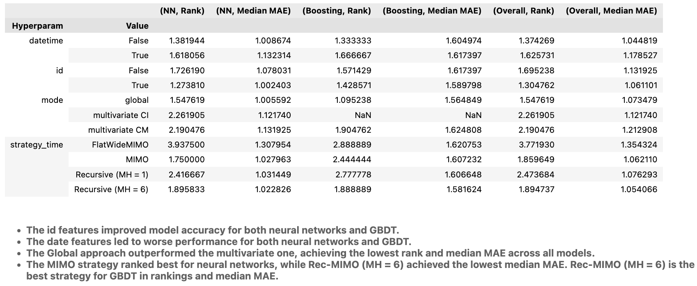

# Tutorials & Examples

This directory collects and aggregates different examples and tutorials on how to use Tsururu for solve various tasks, including benchmarking different models and strategies on different datasets.

## Tutorials
```
Example_1_All_configurations.py             # Script for benchmarking available strategies, models and preprocessing methods on a dataset.
Tutorial_1_Quick_start.ipynb                # Simple usage examples
Tutorial_2_Strategies.ipynb                 # Covers forecasting strategies.
Tutorial_3_Transformers_and_Pipeline.ipynb  # Provides a description of available data preprocessing techniques.
Tutorial_4_Neural_Networks.ipynb            # Demonstrates working with neural networks.
```

## Benchmarking (IJCAI 2025 Demo Track): Main Results
In the paper accepted to the Demo-Track of IJCAI 2025, we benchmarked Tsururu on the ILI dataset. The results are summarized below.

1. **Critical difference diagram**
  Visualizes the ranking of preprocessing methods across other fixed hyperparameters of the pipeline. Methods not connected by a horizontal line are significantly different.


   **Key findings:** 
   - The LastKnownNormalizer significantly outperforms default preprocessing strategies.

2. **Ablation on hyperparameters**

| Hyperparam      | Value               | (NN, Rank) | (NN, Median MAE) | (Boosting, Rank) | (Boosting, Median MAE) | (Overall, Rank) | (Overall, Median MAE) |
|-----------------|---------------------|------------|------------------|------------------|------------------------|-----------------|-----------------------|
| Datetime Features        | False               | 1.3819     | 1.0087           | 1.3333           | 1.6050                 | 1.3743          | 1.0448                |
| Datetime Features        | True                | 1.6181     | 1.1323           | 1.6667           | 1.6174                 | 1.6257          | 1.1785                |
| ID Features              | False               | 1.7262     | 1.0780           | 1.5714           | 1.6174                 | 1.6952          | 1.1319                |
| ID Features              | True                | 1.2738     | 1.0024           | 1.4286           | 1.5898                 | 1.3048          | 1.0611                |
| Mode            | global              | 1.5476     | 1.0056           | 1.0952           | 1.5648                 | 1.5476          | 1.0735                |
| Mode            | multivariate CI     | 2.2619     | 1.1217           | NaN              | NaN                    | 2.2619          | 1.1217                |
| Mode            | multivariate CM     | 2.1905     | 1.1319           | 1.9048           | 1.6248                 | 2.1905          | 1.2129                |
| Prediction Strategy   | FlatWideMIMO        | 3.9375     | 1.3080           | 2.8889           | 1.6208                 | 3.7719          | 1.3543                |
| Prediction Strategy   | MIMO                | 1.7500     | 1.0280           | 2.4444           | 1.6072                 | 1.8596          | 1.0621                |
| Prediction Strategy   | Recursive (MH = 1)  | 2.4167     | 1.0314           | 2.7778           | 1.6066                 | 2.4737          | 1.0763                |
| Prediction Strategy   | Recursive (MH = 6)  | 1.8958     | 1.0228           | 1.8889           | 1.5816                 | 1.8947          | 1.0541                |

   **Key findings:**
   - The id features improved model accuracy for both neural networks and GBDT.
   - The date features led to worse performance for both neural networks and GBDT.
   - The Global approach outperformed the multivariate one, achieving the lowest rank and median MAE across all models.
   - The MIMO strategy ranked best for neural networks, while Rec-MIMO (MH = 6) achieved the lowest median MAE. Rec-MIMO (MH = 6) is the best strategy for GBDT in rankings and median MAE.

3. **Ranking of models**

| rank | Model (test) | Strategy (test)      | MAE (test) | Model (val) | Strategy (val)       | MAE (val) |
|------|--------------|----------------------|------------|-------------|----------------------|-----------|
| 1    | GPT4TS       | Recursive (MH = 6)   | 0.7804     | GPT4TS      | MIMO                 | 0.2713    |
| 2    | GPT4TS       | Recursive (MH = 1)   | 0.7822     | GPT4TS      | Recursive (MH = 6)   | 0.2833    |
| 3    | PyBoost      | FlatWideMIMO         | 0.7921     | GPT4TS      | Recursive (MH = 1)   | 0.2938    |
| 4    | GPT4TS       | MIMO                 | 0.7926     | PatchTST    | MIMO                 | 0.3005    |
| 5    | PatchTST     | Recursive (MH = 6)   | 0.8630     | PatchTST    | Recursive (MH = 6)   | 0.3050    |
| 6    | PatchTST     | MIMO                 | 0.8769     | DLinear     | Recursive (MH = 6)   | 0.3169    |
| 7    | PatchTST     | Recursive (MH = 1)   | 0.8949     | PatchTST    | Recursive (MH = 1)   | 0.3180    |
| 8    | DLinear      | Recursive (MH = 6)   | 0.9193     | DLinear     | MIMO                 | 0.3205    |
| 9    | DLinear      | MIMO                 | 0.9220     | PyBoost     | FlatWideMIMO         | 0.3239    |
| 10   | DLinear      | Recursive (MH = 1)   | 0.9314     | DLinear     | Recursive (MH = 1)   | 0.3313    |

   **Key findings:**
   - GPT4TS outperformed all other models.
   - The Rec-MIMO strategy with MH = 6 achieved the best overall test MAE. However, on the validation set, the highest-ranked strategy was MIMO.
   - The FlatWideMIMO combined with boosting models also ranked among the top strategies.


## Benchmarking: Additional Results
You can find aggregated results in `all_configurations_benchmark/notebooks/aggregated_results.ipynb` notebook ([here](https://github.com/sb-ai-lab/tsururu/blob/main/examples/all_configurations_benchmark/notebooks/aggregated_results.ipynb)) in the same format, as in the paper on ILI dataset.

 We provide extended results on other datasets, including [NN5](https://zenodo.org/records/3889740), [FRED-MD](https://zenodo.org/records/4654833), [WTH](https://github.com/juyongjiang/TimeSeriesDatasets), [Demand Forecasting Kernels](https://www.kaggle.com/c/demand-forecasting-kernels-only/overview).

## Benchmarking: Reproduce Results / Get New on Custom Datasets or Models
You can use Tsururu to benchmark different models and strategies on various datasets. The `all_configurations_benchmark` directory contains scripts and notebooks that help you run experiments, clean results, and visualize aggregated metrics.

How to reproduce results or get new results on custom datasets or model using Tsururu:
1. **Run experiments**
   - (if new) Add settings to `scripts/constants.py`, related to the dataset and models you want to benchmark.
   - Use `scripts/run_exp.py` to launch your experiments.
   - Use `scripts/get_results.py` to parse the raw logs and generate a CSV file with scaled metrics.

2. **Clean raw outputs**  
   - Use `notebooks/clean_results.ipynb` to clean and normalize the results from `get_results.py`.

3. **Aggregate and visualize**  
   - Use `notebooks/aggregated_results.ipynb` to generate summary tables and plots from the cleaned results.

additionally:
`scripts/run_exp_ratio.py` is the same as run_exp.py, but for ratio regime in transformers.
`scripts/validation.py` contains useful functions to do proper validation.


## Reproducibility Check
Also we provide scripts to reproduce results of the original implementations of the models and comparing them with Tsururu's verisons. You can find them in the `reproducibility_check` directory.
```
reproducibility_check
└── config/     # Configuration files
└── run_all.sh  # Shell script to execute the full reproducibility_check pipeline end-to-end
└── run_exp.py  # Script to launch experiments for the config file
```
