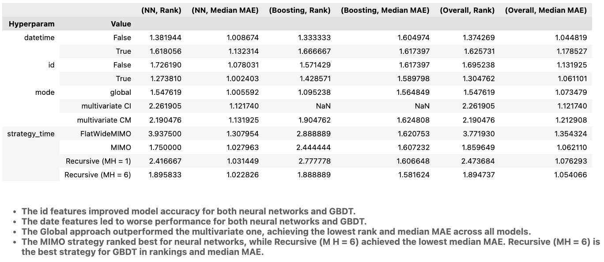
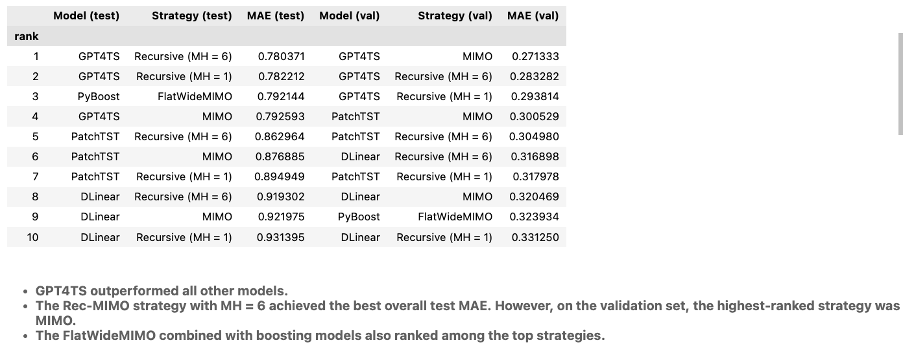

# Tutorials & Examples

This directory collects and aggregates different examples and tutorials on how to use Tsururu for solve various tasks, including benchmarking different models and strategies on different datasets.

## Tutorials
```
Example_1_All_configurations.py             # Script for benchmarking available strategies, models and preprocessing methods on a dataset.
Tutorial_1_Quick_start.ipynb                # Simple usage examples
Tutorial_2_Strategies.ipynb                 # Covers forecasting strategies.
Tutorial_3_Transformers_and_Pipeline.ipynb  # Provides a description of available data preprocessing techniques.
Tutorial_4_Neural_Networks.ipynb            # Demonstrates working with neural networks.
```

## Benchmarking
You can use Tsururu to benchmark different models and strategies on various datasets. The `all_configurations_benchmark` directory contains scripts and notebooks that help you run experiments, clean results, and visualize aggregated metrics.
```
all_configurations_benchmark
├── scripts
│   ├── constants.py      # Parameters for models for each dataset
│   └── validation.py     # Some useful functions to do proper validation
│   ├── run_exp.py        # Run a full experiments over all interesting configurations
│   ├── run_exp_ratio.py  # The same as run_exp.py, but for ratio regime in transformers
│   ├── get_results.py    # Load and parse raw experiment results to scaled metrics and aggregate them in one csv file
|
├── notebooks
│   ├── clean_results.ipynb       # Clean and normalize results from get_results.py
│   └── aggregated_results.ipynb  # Generate summary tables & plots
│
├── results
│   └── agg_results__normalized_True_cleaned.csv  # Output of clean_results.ipynb for some datasets
```

### Extended results of paper, accepted to Demo-Track IJCAI 2025 
Paper on Tsururu was accepted to the Demo-Track of IJCAI 2025. In the paper we provide results on ILI dataset. Here we provide extended results on other datasets, including NN5, FredMD, WTH, Demand Forecasting Kernels.

You can find aggregated results in `notebooks/aggregated_results.ipynb` notebook in the same format, as in the paper on ILI dataset.

How to reproduce results:
1. **Run experiments**  
   - Add settings to `scripts/constants.py`, related to the dataset and models you want to benchmark.
   - Use `scripts/run_exp.py` to launch your experiments on any dataset.
   - Use `scripts/get_results.py` to parse the raw logs and generate a CSV file with scaled metrics.

2. **Clean raw outputs**  
   - Use `notebooks/clean_results.ipynb`.

3. **Aggregate and visualize**  
   - Use `notebooks/aggregated_results.ipynb`.

Also we provide scripts to reproduce results of the original implementations of the models and comparing them with Tsururu's verisons. You can find them in the `reproducibility_check` directory.
```
reproducibility_check
└── config/     # Configuration files
└── run_all.sh  # Shell script to execute the full reproducibility_check pipeline end-to-end
└── run_exp.py  # Script to launch experiments for the config file
```

### Results of the paper on ILI dataset:

1. **Critical difference diagram**
   - Visualizes the ranking of preprocessing methods across other fixed hyperparameters of the pipeline. Methods not connected by a horizontal line are significantly different.


2. **Ablation on hyperparameters**


3. **Ranking of models**

